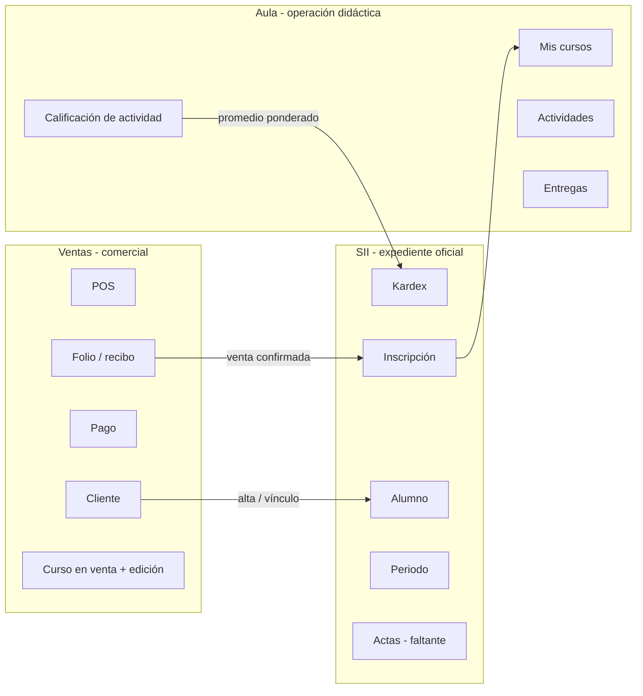

# Roles, dominios, RBAC y roadmap

Documento de análisis para planear **qué ve cada persona**, **qué feature pertenece a qué dominio** y **cómo implementar el control de acceso**. No es una guía de uso: es la base para el siguiente corte de producto.

Estado de referencia: el código actual (grupos Django, middleware por prefijo `/ventas` `/sii` `/aula`, y alcance de queryset en SII/Aula).

---

## 1. Qué problema resuelve este documento

Hoy el acceso es **por módulo entero**:

| Grupo | Ventas | SII | Aula |
| :--- | :--- | :--- | :--- |
| Administradores / superusuario | todo | todo | todo |
| Vendedores | todo | nada | nada |
| Docentes | nada | lectura + sin altas | sus cursos |
| Alumnos | nada | nada | sus cursos + kardex (mal ubicado) |

Eso choca con los casos de uso reales:

- Un **alumno** sí tiene relación con Ventas (sus compras y recibos), pero no con el POS ni con el padrón de clientes.
- El **kardex** es expediente académico oficial: pertenece a **SII**, no al aula.
- Un **vendedor** no debe operar control escolar; un **docente** no debe cobrar.
- El **superusuario** sí ve todo, incluido Django Admin.

Hay que pasar de “¿puede entrar a `/ventas`?” a “¿puede ejecutar *esta* feature, sobre *estos* registros?”.

---

## 2. Personas (quién inicia sesión)

### 2.1 Las cuatro de negocio (las que mencionaste)

Son las únicas personas de operación. Cada una tiene (o debe tener) un registro de dominio ligado al `User` de la base `auth` por `user_id` (no hay FK real entre bases).

| Persona | Grupo Django | Registro de dominio | Qué es en la vida real |
| :--- | :--- | :--- | :--- |
| **Vendedor** | `Vendedores` | `cat_vendedor` | Call center / asesor: vende, cobra, da de alta clientes. |
| **Administrador** | `Administradores` | (el grupo; no hay ficha `cat_administrador`) | Control escolar + supervisión de la plataforma de negocio. |
| **Docente** | `Docentes` | `cat_docente` | Maestro del grupo: imparte, publica actividades, califica. |
| **Alumno** | `Alumnos` | `cat_alumno` | Estudiante: estudia, entrega, consulta expediente y sus pagos. |

`Cliente` (`cat_cliente`) **no es un rol de login**. Es la ficha comercial de una persona. Al vender, el sistema ya crea o enlaza un `Alumno` (`crear_alumno_desde_cliente`). El login del estudiante es el del alumno, no el del cliente.

### 2.2 Superusuario (overlay técnico, no un quinto oficio)

`User.is_superuser` (y, en la práctica, staff + Django Admin).

- Bypass de todas las features.
- Usuarios, grupos, migraciones, datos crudos.
- No sustituye al Administrador de control escolar: el superusuario es quien *configura* Ingenio; el administrador es quien *opera* la escuela.

Regla: **si `is_superuser` → todas las features, todos los registros**. El grupo `Administradores` se asigna además para que la UI de negocio no dependa de conocer `is_superuser`.

### 2.3 Candidatos que *no* son un quinto usuario (por ahora)

Revisados en código y descartados como login aparte:

| Candidato | Por qué no es persona nueva |
| :--- | :--- |
| **Coordinador de curso** | Flag `DocenteCurso.es_coordinador`. Es una capacidad del docente, no un grupo. Si más adelante el coordinador publica actas o cierra grupo, se modela como feature extra del mismo rol. |
| **Caja / cobranza** | Hoy el vendedor cobra (`/ventas/pagos/`). Separarlo solo tiene sentido si el call center no debe ver montos o catálogo. No hay evidencia de ese oficio todavía. |
| **Cliente portal** | Sería un segundo login para la misma persona que ya es Alumno. Unificar: el alumno ve “Mis compras”. |
| **App `administrador/` y `docente/` vacías** | Apps Django sin vistas. No son roles; son deuda de estructura. |

Conclusión: **4 roles de negocio + superusuario**. No inventar un quinto hasta que un caso de uso lo exija (el más probable a futuro sería Caja).

---

## 3. Dominios: dueño de cada feature

Ingenio no es tres productos pegados. Es **un expediente de persona** visto por tres oficios. El corte no es “quién entra al menú”, es **quién es dueño del dato y de la operación**.



### 3.1 Ventas — “se vendió y se cobró”

Dueño del **dinero y de la oferta comercial**.

| Feature | Pantalla actual | Caso de uso |
| :--- | :--- | :--- |
| Panel comercial | `/ventas/` | Resumen del call center |
| POS | `/ventas/nueva/` | Levantar folio: cliente + edición con cupo |
| Folios | `/ventas/folios/` | Operar / editar ventas |
| Pagos (caja) | `/ventas/pagos/` | Registrar cobro, pendientes |
| Clientes | `/ventas/clientes/` | Padrón comercial |
| Cursos en venta | `/ventas/cursos/` | Catálogo / precio / modalidad |
| Ediciones | `/ventas/ediciones/` | Grupo de fecha + cupo |
| Vendedores | `/ventas/vendedores/` | Equipo y comisión |
| **Mis compras / recibos** | **no existe** | Alumno (o cliente-alumno) ve *sus* folios y comprobantes |

Efectos hacia otros dominios (ya existen, no son pantallas de Ventas):

- Alta de `Cliente` → puede crear `Alumno`.
- Venta confirmada → `inscribir_desde_venta` crea `Inscripcion` en SII y reserva cupo.

Ventas **no es dueño** del kardex, periodos, bajas académicas ni actividades.

### 3.2 SII — “el expediente es verdad”

Dueño del **estatus académico oficial**. Control escolar.

| Feature | Pantalla actual | Caso de uso |
| :--- | :--- | :--- |
| Panel SII | `/sii/` | Tablero de control escolar |
| Alumnos | `/sii/alumnos/` | Alta académica (también sin pasar por venta) |
| Cursos académicos | `/sii/cursos/` | Catálogo escolar (puede vivir sin oferta de venta) |
| Periodos | `/sii/periodos/` | Calendario institucional |
| Inscripciones | `/sii/inscripciones/` | Alta, baja, reintento |
| Docentes (plantilla) | `/sii/docentes/` | Ficha y asignación a curso |
| **Kardex** | hoy `/aula/kardex/` | Consulta oficial de calificaciones / historial |
| Actas / cierre de periodo | no existe | Documento oficial del grupo |
| Horario institucional | no existe (el redirect `/alumnos/horario/` va al aula) | Calendario por periodo/grupo |

El kardex **consulta** SII (`Inscripcion.calificacion` + modelo `aula.Kardex` que es un derivado). Que Aula *calcule* el promedio no lo convierte en dueño de la pantalla. Misma lógica que un POS que dispara inscripción: el asiento vive en SII.

**Mover:** `aula_kardex` → ruta SII (`/sii/kardex/` o `/sii/mi-kardex/` según rol). El sidebar de Aula deja de listar Kardex. El de SII lo gana. El alumno, al entrar a SII, no ve el padrón completo: ve *su* kardex (y quizá su ficha).

### 3.3 Aula — “qué pasa esta semana en el grupo”

Dueño de la **operación didáctica**, no del expediente.

| Feature | Pantalla actual | Caso de uso |
| :--- | :--- | :--- |
| Mis cursos | `/aula/` | Lista de grupos del usuario |
| Curso | `/aula/cursos/<id>/` | Actividades del grupo |
| Nueva / editar actividad | `/aula/cursos/<id>/actividades/...` | Docente publica |
| Entregar | `/aula/actividades/<id>/entregar/` | Alumno entrega (hoy texto; faltan archivos) |
| Calificar | `/aula/actividades/<id>/calificar/` | Docente captura; escribe promedio hacia kardex |

Aula **no es dueño** de: plantilla docente, periodos, bajas, recibos, POS. Asignar docente desde el curso (`aula_asignar_docente`) es un atajo de administrador; el dueño canónico es SII → Docentes.

### 3.4 Transversal (ningún dominio)

| Feature | Dónde | Notas |
| :--- | :--- | :--- |
| Login / logout | `/` | Público |
| Hoy | `/inicio/` | Escritorio filtrado por features del rol |
| Mi cuenta | `/cuenta/` | Perfil; hoy es de solo lectura y enlaza kardex del aula (hay que apuntarlo a SII) |
| Django Admin | `/admin/` | Solo superusuario / staff |

---

## 4. Casos de uso por persona

Cada caso se lee como: **actor → objetivo → dominio dueño → pantallas → alcance de datos**.

### 4.1 Vendedor

1. Dar de alta o localizar un cliente y vender un curso/edición con cupo → Ventas POS.
2. Ver folios del día y pendientes de cobro → Folios + banner de cobro.
3. Registrar un pago (transferencia / referencia) → Pagos.
4. Consultar o editar el padrón comercial y el catálogo de oferta → Clientes, Cursos, Ediciones.
5. No opera bajas, kardex ni actividades. Si necesita saber “¿ya está inscrito?”, eso es un **dato de lectura** (badge o link), no una pantalla SII completa.

Alcance de datos: **todos los registros comerciales** (el call center es compartido). Más adelante se puede acotar “solo mis folios”; no es el caso actual.

### 4.2 Administrador (control escolar)

1. Expediente: alta de alumno sin venta, edición de ficha, estado → SII Alumnos.
2. Inscribir, dar de baja, reintentar → SII Inscripciones.
3. Periodos, cursos académicos, plantilla y asignación docente → SII.
4. Consultar kardex de cualquier alumno → SII Kardex (alcance: todos).
5. Supervisar aula: entrar a cualquier grupo, no necesariamente crear tareas.
6. Ver el estado de cobro (¿puede cursar si no ha pagado?) → **lectura** de Ventas (folios/pagos), no POS.
7. No es el operador diario del call center, pero sí puede entrar si hace falta (el superusuario y el administrador ven todo lo de negocio).

### 4.3 Docente

1. Ver *sus* grupos y alumnos inscritos → Aula Mis cursos; SII Alumnos/Inscripciones **solo lecturas de su asignación**.
2. Publicar actividades, recibir entregas, calificar → Aula.
3. Consultar kardex de *sus* alumnos (oficial) → SII Kardex con alcance `assigned`.
4. No vende, no cobra, no da de alta periodos, no asigna a otros docentes (salvo que sea coordinador *y* se decida esa feature después).

### 4.4 Alumno

1. Ver *sus* cursos y entregar actividades → Aula.
2. Ver *su* kardex oficial → **SII**, no Aula.
3. Ver *sus* compras: folios, estado de pago, recibos/comprobantes → **Ventas**, feature `mis_compras`, alcance `own`.
4. Editar *su* perfil (nombre visible, teléfono; no CURP/estado académico) → Cuenta. Hoy no es editable.
5. No ve otros alumnos, no ve POS, no ve catálogo interno, no da de baja inscripciones.

Vínculo de datos para `own` en Ventas: `Cliente.id_alumno_sii` o mismo email que `Alumno`. Hay que endurecer ese enlace (hoy el signal solo corre en *creación* de cliente).

### 4.5 Superusuario

Todos los casos anteriores + Django Admin + APIs internas (`/api*` ya está restringida a administrador).

---

## 5. Matriz de acceso (objetivo)

Leyenda de alcance:

- **all** — cualquier registro del dominio
- **assigned** — solo grupos/cursos donde el docente está en `DocenteCurso`
- **own** — solo el registro ligado a su ficha (`Alumno` / `Cliente` / `Vendedor`)
- **—** — sin feature (ni menú ni URL útil; 403 o redirect a Hoy)

Escritura implica lectura. “R” lectura, “W” alta/edición/baja de esa feature.

### 5.1 Ventas

| Feature | Vendedor | Administrador | Docente | Alumno | Superuser |
| :--- | :--- | :--- | :--- | :--- | :--- |
| Panel comercial | R all | R all | — | — | all |
| POS | W all | W all | — | — | all |
| Folios (operación) | W all | W all | — | — | all |
| Pagos (caja) | W all | W all | — | — | all |
| Clientes | W all | W all | — | — | all |
| Cursos en venta | W all | W all | — | — | all |
| Ediciones | W all | W all | — | — | all |
| Vendedores | R all / W admin | W all | — | — | all |
| **Mis compras / recibos** | — (usa Folios) | R all | — | **R own** | all |

El alumno **sí entra al módulo Ventas**, pero el menú no muestra POS ni Clientes: solo “Mis compras”. El middleware actual, que bloquea `/ventas` entero a quien no es vendedor/admin, es incompatible con este renglón.

### 5.2 SII

| Feature | Vendedor | Administrador | Docente | Alumno | Superuser |
| :--- | :--- | :--- | :--- | :--- | :--- |
| Panel SII | — | R all | R assigned | R own (resumen) | all |
| Alumnos | — (ver cliente, no padrón SII) | W all | R assigned | R own (su ficha) | all |
| Cursos académicos | — | W all | R assigned | R own (los inscritos) | all |
| Periodos | — | W all | R all (calendario) | R all (su calendario) | all |
| Inscripciones | — | W all | R assigned | R own | all |
| Docentes / asignación | — | W all | R own (su ficha) | — | all |
| **Kardex** | — | R all | R assigned | **R own** | all |
| Actas (faltante) | — | W all | W assigned (si se decide) | — | all |

El alumno **sí entra a SII**, pero no al padrón: Kardex (y ficha / inscripciones propias). Eso también rompe el middleware “SII = admin+docente”.

### 5.3 Aula

| Feature | Vendedor | Administrador | Docente | Alumno | Superuser |
| :--- | :--- | :--- | :--- | ---: | :--- |
| Mis cursos | — | R/W all | R assigned + W actividades | R own | all |
| Entregar | — | — | — | W own | all |
| Calificar | — | W all | W assigned | — | all |
| Asignar docente (atajo) | — | W all | — | — | all |
| Kardex | — | **sale de Aula** | **sale de Aula** | **sale de Aula** | — |

### 5.4 Hoy y cuenta

| Feature | Vendedor | Administrador | Docente | Alumno |
| :--- | :--- | :--- | :--- | :--- |
| Hoy | KPIs y folios comerciales | KPIs SII + cobro | Mis grupos / por calificar | Mis cursos / avisos de pago |
| Mi cuenta | su usuario | su usuario | su usuario | su usuario + atajo a kardex SII y mis compras |

---

## 6. Qué hay hoy vs la matriz

### 6.1 Ya cubierto (a nivel de oficio, no de feature)

- Grupos `Vendedores`, `Docentes`, `Alumnos`, `Administradores`.
- Superusuario infiere administrador y ve los tres módulos.
- Escritura SII (altas, baja, reintento) limitada a `es_administrador`.
- Querysets `alumnos_visibles` / `cursos_visibles` / `inscripciones_visibles` con alcance admin / assigned / own. **Esto se reutiliza**, no se tira.
- Venta → inscripción y Cliente → Alumno.

### 6.2 Huecos de producto (features que el caso de uso pide y no existen o están mal colgadas)

| Hueco | Dominio dueño | Quién lo sufre |
| :--- | :--- | :--- |
| **Mis compras / recibos** | Ventas | Alumno |
| **Kardex en SII** (hoy vive en Aula) | SII | Alumno, docente, control escolar |
| Perfil editable | Transversal | Todos |
| Usuario de login al dar de alta docente (alumno ya tiene signal, frágil) | SII / auth | Docente, alumno |
| Actas de grupo / cierre | SII | Administrador, docente |
| Horario real | SII (oficial) + Aula (vista semanal) | Alumno, docente |
| Entrega con archivo | Aula | Alumno |
| Comprobante descargable (PDF) del folio | Ventas | Alumno, vendedor |
| Pago en línea | Ventas | Alumno (self-service) — después de mis compras |
| Apps `docente/` y `administrador/` vacías | estructura | mantenimiento |
| Alta de alumno **sin** crear usuario / sin invitación usable | SII | Alumno no puede entrar aunque exista la ficha |

### 6.3 Huecos de autorización (el código permite de más o de menos)

| Problema | Efecto |
| :--- | :--- |
| Middleware por **prefijo de URL** | Alumno no puede ver recibos; no puede ver kardex en SII. Vendedor no puede ni asomar estado de inscripción. |
| Menú de Ventas es el mismo para todo el que entra | Si se abre `/ventas` al alumno, hoy vería POS y clientes. |
| `asignar_grupos_desde_dominio` deja **un solo grupo** por usuario | Una persona que es docente y administrador pierde el otro oficio. El modelo objetivo debe permitir **unión de features** (grupos múltiples) o un rol primario + flags. |
| Vendedor se **auto-crea** ficha (`obtener_o_crear_desde_usuario`) al usar el POS | Cualquier usuario con acceso accidental a Ventas se vuelve vendedor de dominio. |
| Signal de alumno crea `User` con password aleatorio **sin notificarse** | Hay cuenta, no hay acceso real. |
| Django `Permission` por modelo casi no se usa | No hay catálogo de features versionable. |
| APIs DRF (`/api`) solo admin | Bien como default; no cubre un futuro portal alumno. |

---

## 7. Arquitectura de implementación RBAC

Objetivo: **feature + alcance**, no módulo binario. Encaja en el monolito Django actual; no hace falta un IAM aparte.

### 7.1 Capas

```text
User (auth)
  └─ groups  ──►  Role
                    └─ features[]  (código estable)
                         └─ vista / menú / API
                              └─ scope: all | assigned | own
                                   └─ queryset (ya existe el patrón en identity.py)
```

1. **Identidad** — `User` + ficha de dominio (`Vendedor` / `Docente` / `Alumno`). El superusuario no requiere ficha.
2. **Rol** — los 4 grupos actuales. Un usuario puede tener más de un grupo (excepción real: staff que también imparte). Dejar de forzar “un grupo gana”.
3. **Feature** — string estable, namespaced por dominio: `ventas.pos`, `ventas.mis_compras`, `sii.kardex`, `sii.alumnos.write`, `aula.calificar`.
4. **Alcance** — función por feature, no un flag global. `sii.kardex` + alumno ⇒ `own`; + docente ⇒ `assigned`; + admin ⇒ `all`.
5. **Superusuario** — `has_feature(*) == True` y `scope == all`.

### 7.2 Dónde vive el catálogo (recomendación)

**Catálogo en código** (`sii/rbac.py` o `sii/features.py`), no en Django Admin al inicio.

```python
# Esquema propuesto (no implementado en este documento)
FEATURES = {
    "ventas.pos": {"roles": {VENDEDOR, ADMIN}, "scope": "all"},
    "ventas.mis_compras": {"roles": {ALUMNO, ADMIN}, "scope": "own"},  # admin: all
    "sii.kardex": {"roles": {ADMIN, DOCENTE, ALUMNO}},
    "sii.alumnos.write": {"roles": {ADMIN}},
    "aula.calificar": {"roles": {ADMIN, DOCENTE}, "scope": "assigned"},
}
```

Por qué no `django.contrib.auth.Permission` todavía: esas permisos son CRUD por modelo (`sii | alumno | add`) y no expresan “mis compras” ni “kardex assigned”. Se pueden *sincronizar* después si hace falta un admin de permisos.

Por qué no un paquete tipo Guardian en el primer corte: el alcance `own`/`assigned` ya está a medio hacer con querysets. Guardian aporta object-permissions genéricas que aquí se resuelven con `alumno_para_usuario()` y `DocenteCurso`.

### 7.3 Cómo se aplica en request

Reemplazar (o vaciar) `ModuloAccessMiddleware` como candado de prefijo.

| Capa | Mecanismo | Responsabilidad |
| :--- | :--- | :--- |
| Menú / Hoy | `context_processors` filtra `ingenio_modules` y `ingenio_sidebar` por `has_feature` | No mostrar lo que no se puede usar |
| Vista | decorador `@requiere_feature("ventas.pos")` | 403 o redirect, no “módulo entero” |
| Queryset | `ventas_visibles(user)`, reutilizar `*_visibles` de SII | Un alumno con `ventas.mis_compras` no lista el padrón |
| Plantilla | `` solo para matices (botón Cobrar vs Ver recibo) | Defensa en profundidad, no la única |

URLs pueden convivir en el mismo app (`ventas/views.py`) con dos vistas: `pagos_view` (caja) vs `mis_compras_view` (alumno). Mezclarlas en una tabla con columnas de “Eliminar” y esperar a que el JS las esconda **no** es RBAC.

### 7.4 Resolución de alcance (contratos)

```text
ventas_visibles(user):
  admin/super → Venta.objects.all()
  vendedor    → Venta.objects.all()          # call center compartido
  alumno      → Venta.objects.filter(id_cliente__id_alumno_sii=alumno)
  resto       → none()

kardex_visible(user):  # ya casi es inscripciones_visibles
  admin    → todas
  docente  → inscripciones de sus cursos
  alumno   → las suyas
```

Si `Cliente.id_alumno_sii` está vacío, el fallback es email; el roadmap incluye **normalizar ese vínculo**.

### 7.5 Menús objetivo (después de RBAC)

**Vendedor — Ventas:** Panel, POS, Folios, Pagos, Clientes, Cursos, Ediciones. (Vendedores: solo admin o lectura).

**Administrador — los tres módulos**, menús completos. Kardex bajo SII. Aula sin kardex.

**Docente — SII:** Panel, *sus* Alumnos, Inscripciones (R), Kardex. **Aula:** Mis cursos. Sin Ventas.

**Alumno — SII:** Kardex (y ficha). **Aula:** Mis cursos. **Ventas:** Mis compras. Hoy muestra esos tres atajos, no el POS.

Barra superior: un módulo aparece si el usuario tiene **al menos una** feature de ese dominio. Por eso el alumno ve el chip Ventas (mis compras) y el chip SII (kardex) sin ver control escolar.

### 7.6 Relación con las apps Django

Las apps actuales no coinciden con los oficios. No hace falta fusionarlas para el primer RBAC; sí conviene **dejar de añadir pantallas en el lugar equivocado**.

| App | Debe contener | No debe contener |
| :--- | :--- | :--- |
| `ventas` | POS, folios, pagos, clientes, oferta, **mis compras** | Kardex, inscripciones |
| `sii` | Padrones, periodos, inscripciones, **kardex**, actas | Actividades, POS |
| `aula` | Actividades, entregas, calificación de actividad | Kardex de consulta, plantilla docente |
| `alumnos` | Deprecar vistas; dejar redirects a SII/Aula | Nueva UI |
| `docente` / `administrador` | Modelos (`Docente`) o retirar apps vacías | Una UI paralela |
| `usuario` | Perfil, password | Atajos mal dirigidos |

---

## 8. Roadmap

Orden técnico: primero el candado y el menú; **luego la costura de modelo** (grupo/edición en la inscripción); después recolocar kardex y mis compras. El inventario detallado de huecos está en [features-faltantes-por-dominio.md](features-faltantes-por-dominio.md).

Sin fechas: cada fase es un corte mergeable.

### Fase 0 — Catálogo y candado (fundación)

- Extraer `FEATURES` + `has_feature` / `scope_for` + `@requiere_feature`.
- Permitir **varios grupos** por usuario; dejar de pisar roles en `asignar_grupos_desde_dominio`.
- Cambiar el middleware de prefijo por el decorador (o un middleware que resuelva *feature de la URL*, no módulo).
- Filtrar barra y sidebar con el catálogo.
- Tests por rol: vendedor no entra a calificar; alumno no entra a POS; superusuario sí.

**Criterio de hecho:** un alumno autenticado recibe 403 en `/ventas/nueva/` y 200 en una vista `own` (aunque esa vista aún sea un placeholder).

### Fase 0.5 — Costura de grupo (modelo)

Sin esto, kardex y aula hablan de un curso catálogo, no del grupo que se vendió.

- Ligar `Inscripcion` a edición/grupo (y permitir historial por periodo; hoy `unique_together` alumno+curso borra historia en el reintento).
- Gate de pago: no dejar cursar (o no activar aula) con folio pendiente.
- Sync cliente ↔ alumno también al editar, no solo al crear.
- Segunda venta del mismo curso: avisar o reintentar; `cantidad>1` no puede fingir N inscripciones.

**Criterio de hecho:** una venta reserva cupo **y** la inscripción apunta a esa edición; una baja puede liberar cupo.

### Fase 1 — Recolocar lo que ya existe

- Mover **Kardex** a SII (`/sii/kardex/`), menú SII, quitarlo de Aula. Redirect de `/aula/kardex/` y `/alumnos/kardex/`.
- Mi cuenta apunta al kardex SII.
- Docente/alumno siguen viendo los mismos renglones (mismos querysets), en el dominio correcto.
- Hoy del alumno: atajo Kardex + Mis cursos (aún sin recibos).

**Criterio de hecho:** ningún sidebar de Aula muestra “Kardex”.

### Fase 2 — Alumno en Ventas (mis compras)

- Vista `mis_compras` / `recibo` con `ventas_visibles` alcance `own`.
- Endurecer `Cliente.id_alumno_sii` (backfill por email; no solo en `created`).
- Menú Ventas del alumno: solo esa entrada. Sin POS, clientes, ediciones.
- Recibo imprimible (HTML/PDF simple del folio + pagos). El PDF pulido puede esperar.

**Criterio de hecho:** el alumno ve *sus* folios y un 404/vacío si no hay venta ligada; no lista ventas ajenas (test de queryset).

### Fase 3 — Identidad usable

- Alta de alumno y de docente crea o vincula `User`, asigna grupo, y deja un flujo de “definir contraseña” (email o pantalla de admin con password temporal visible una vez).
- Perfil editable (cuenta): nombre para mostrar, teléfono; campos académicos (CURP, estado) solo SII admin.
- Dejar de auto-crear `Vendedor` para cualquier usuario que pise el POS: solo grupo `Vendedores` o admin.

### Fase 4 — Expediente SII que aún falta

- Actas / cierre de grupo (calificación oficial congelada por periodo).
- Horario: modelo mínimo (curso + periodo + slots) en SII; el aula puede *mostrar* el de la semana, no ser dueño.
- Ficha de alumno para el propio alumno (lectura) desde SII.

### Fase 5 — Aula completa

- Entrega con archivo (storage).
- Mejorar calificación masiva y avisos “por calificar” en Hoy del docente.
- Quitar el atajo “asignar docente” del aula o dejarlo solo como alias de la pantalla SII.

### Fase 6 — Cobro self-service y limpieza

- Pago en línea sobre *mis compras* (pasarela); la caja del call center permanece.
- Retirar o fusionar apps vacías `administrador/` (vistas) y redirects muertos.
- Documentar Ventas y Aula para operación (el README hoy habla del SII escolar).

---

## 9. Decisiones que este documento ya toma

Para no reabrirlas en cada ticket:

1. **Cuatro roles de negocio + superusuario.** Coordinador y Caja no son grupos hasta que un caso lo pida.
2. **Kardex es SII.** Aula escribe el insumo (calificación de actividad); SII muestra el expediente.
3. **El alumno entra a Ventas solo por mis compras, y a SII solo por su expediente.** El middleware por carpeta desaparece.
4. **El administrador de negocio ve todo el negocio** (no solo SII). El recorte fino es el vendedor/docente/alumno.
5. **RBAC = features en código + alcance en querysets + menú filtrado.** Sin IAM externo en este corte.
6. **`Cliente` no inicia sesión.** El alumno es la persona; el cliente es la ficha comercial.

## 10. Decisiones que sí hay que confirmar al implementar

- ¿El vendedor puede *ver* (solo lectura) si el cliente ya tiene inscripción, o ni siquiera eso?
- ¿El docente publica actas o solo control escolar?
- ¿Un usuario puede ser vendedor y docente a la vez? (el código de grupos múltiples debe permitirlo; la escuela puede no usarlo).
- ¿Mis compras muestra ventas `pendiente` (para que el alumno sepa que debe pagar) o solo `pagado`?

La recomendación de este análisis: vendedor con **lectura** de “inscrito / no inscrito” en la ficha de cliente; actas solo administrador en la fase 4; grupos múltiples permitidos; mis compras muestra **todas** las ventas propias, con el badge de pago que ya existe.

---

## Referencias de código

- Grupos y `usuario_es_grupo`: `sii/permissions.py`
- Módulos actuales y querysets: `sii/identity.py`
- Candado por prefijo: `sii/middleware.py`
- Menú: `api/context_processors.py`
- Kardex (hoy en Aula): `aula/views.py` → `aula_kardex`, plantilla `templates/alumnos/kardex.html`
- Promedio hacia expediente: `aula/services.py` → `actualizar_kardex`
- Cliente → Alumno y Venta → Inscripción: `ventas/signals.py`, `ventas/services.py`
