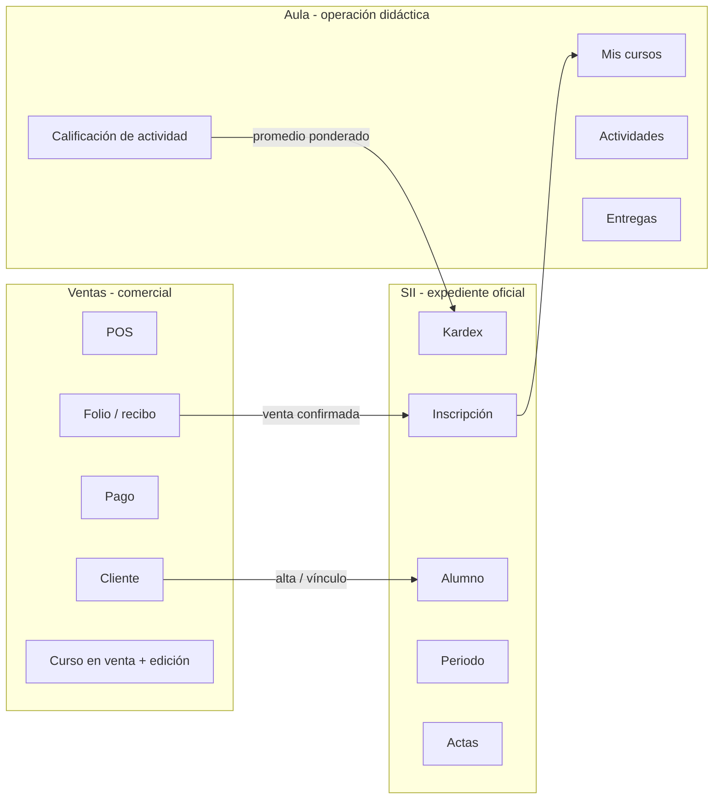

# Roles, dominios, RBAC y roadmap

Documento de análisis para planear **qué ve cada persona**, **qué feature pertenece a qué dominio** y **cómo implementar el control de acceso**. No es una guía de uso: es la base para el siguiente corte de producto.

Estado de referencia: catálogo `sii/rbac.py`, `FeatureAccessMiddleware` por `url_name`, alcance de queryset en SII/Aula/Ventas.

---

## 1. Qué problema resuelve este documento

Hoy el acceso es **por módulo entero**:

| Grupo | Ventas | SII | Aula |
| :--- | :--- | :--- | :--- |
| Administradores / superusuario | todo | todo | todo |
| Vendedores | todo | nada | nada |
| Docentes | nada | lectura + sin altas | sus cursos |
| Alumnos | nada | nada | sus cursos + kardex (mal ubicado) |

Eso choca con los casos de uso reales:

- Un **alumno** sí tiene relación con Ventas (sus compras y recibos), pero no con el POS ni con el padrón de clientes.
- El **kardex** es expediente académico oficial: pertenece a **SII**, no al aula.
- Un **vendedor** no debe operar control escolar; un **docente** no debe cobrar.
- El **superusuario** sí ve todo, incluido Django Admin.

Hay que pasar de “¿puede entrar a `/ventas`?” a “¿puede ejecutar *esta* feature, sobre *estos* registros?”.

---

## 2. Personas (quién inicia sesión)

### 2.1 Las cuatro de negocio (las que mencionaste)

Son las únicas personas de operación. Cada una tiene (o debe tener) un registro de dominio ligado al `User` de la base `auth` por `user_id` (no hay FK real entre bases).

| Persona | Grupo Django | Registro de dominio | Qué es en la vida real |
| :--- | :--- | :--- | :--- |
| **Vendedor** | `Vendedores` | `cat_vendedor` | Call center / asesor: vende, cobra, da de alta clientes. |
| **Administrador** | `Administradores` | (el grupo; no hay ficha `cat_administrador`) | Control escolar + supervisión de la plataforma de negocio. |
| **Docente** | `Docentes` | `cat_docente` | Maestro del grupo: imparte, publica actividades, califica. |
| **Alumno** | `Alumnos` | `cat_alumno` | Estudiante: estudia, entrega, consulta expediente y sus pagos. |

`Cliente` (`cat_cliente`) **no es un rol de login**. Es la ficha comercial de una persona. Al vender, el sistema ya crea o enlaza un `Alumno` (`crear_alumno_desde_cliente`). El login del estudiante es el del alumno, no el del cliente.

### 2.2 Superusuario (overlay técnico, no un quinto oficio)

`User.is_superuser` (y, en la práctica, staff + Django Admin).

- Bypass de todas las features.
- Usuarios, grupos, migraciones, datos crudos.
- No sustituye al Administrador de control escolar: el superusuario es quien *configura* Ingenio; el administrador es quien *opera* la escuela.

Regla: **si `is_superuser` → todas las features, todos los registros**. El grupo `Administradores` se asigna además para que la UI de negocio no dependa de conocer `is_superuser`.

### 2.3 Candidatos que *no* son un quinto usuario (por ahora)

Revisados en código y descartados como login aparte:

| Candidato | Por qué no es persona nueva |
| :--- | :--- |
| **Coordinador de curso** | Flag `DocenteCurso.es_coordinador`. Es una capacidad del docente, no un grupo. Las actas de calificación final las publica el **docente del grupo**, no hace falta un rol extra. |
| **Caja / cobranza** | Hoy el vendedor cobra (`/ventas/pagos/`). Separarlo solo tiene sentido si el call center no debe ver montos o catálogo. No hay evidencia de ese oficio todavía. |
| **Cliente portal** | Sería un segundo login para la misma persona que ya es Alumno. Unificar: el alumno ve “Mis compras”. |
| **App `administrador/`** | Retirada. No era un rol; era deuda de estructura. |
| **App `alumnos/`** | Retirada. Kardex, API y redirects viven en `sii` / `api/urls`. |
| **App `docente/`** | Solo migraciones históricas. `Docente` está en `sii.models`. |

Conclusión: **4 roles de negocio + superusuario**. Un mismo `User` **sí puede llevar más de un grupo** (vendedor + docente). El menú y `has_feature` son la unión. No inventar un quinto oficio hasta que un caso lo pida (el más probable a futuro sería Caja).

---

## 3. Dominios: dueño de cada feature

Ingenio no es tres productos pegados. Es **un expediente de persona** visto por tres oficios. El corte no es “quién entra al menú”, es **quién es dueño del dato y de la operación**.



### 3.1 Ventas — “se vendió y se cobró”

Dueño del **dinero y de la oferta comercial**.

| Feature | Pantalla actual | Caso de uso |
| :--- | :--- | :--- |
| Panel comercial | `/ventas/` | Resumen del call center |
| POS | `/ventas/nueva/` | Levantar folio: cliente + edición con cupo |
| Folios | `/ventas/folios/` | Operar / editar ventas |
| Pagos (caja) | `/ventas/pagos/` | Registrar cobro, pendientes |
| Clientes | `/ventas/clientes/` | Padrón comercial |
| Cursos en venta | `/ventas/cursos/` | Catálogo / precio / modalidad |
| Ediciones | `/ventas/ediciones/` | Grupo de fecha + cupo |
| Vendedores | `/ventas/vendedores/` | Equipo y comisión |
| **Mis compras / recibos** | **no existe** | Alumno (o cliente-alumno) ve *sus* folios y comprobantes |

Efectos hacia otros dominios (ya existen, no son pantallas de Ventas):

- Alta de `Cliente` → puede crear `Alumno`.
- Venta confirmada → `inscribir_desde_venta` crea `Inscripcion` en SII y reserva cupo.

Ventas **no es dueño** del kardex, periodos, bajas académicas ni actividades.

### 3.2 SII — “el expediente es verdad”

Dueño del **estatus académico oficial**. Control escolar.

| Feature | Pantalla actual | Caso de uso |
| :--- | :--- | :--- |
| Panel SII | `/sii/` | Tablero de control escolar |
| Alumnos | `/sii/alumnos/` | Alta académica (también sin pasar por venta) |
| Cursos académicos | `/sii/cursos/` | Catálogo escolar (puede vivir sin oferta de venta) |
| Periodos | `/sii/periodos/` | Calendario institucional |
| Inscripciones | `/sii/inscripciones/` | Alta, baja, reintento |
| Docentes (plantilla) | `/sii/docentes/` | Ficha y asignación a curso |
| **Kardex** | hoy `/aula/kardex/` | Consulta oficial de calificaciones / historial |
| Actas / cierre de periodo | no existe | Documento oficial del grupo |
| Horario institucional | no existe (el redirect `/alumnos/horario/` va al aula) | Calendario por periodo/grupo |

El kardex **consulta** SII (`Inscripcion.calificacion` + modelo `aula.Kardex` que es un derivado). Que Aula *calcule* el promedio no lo convierte en dueño de la pantalla. Misma lógica que un POS que dispara inscripción: el asiento vive en SII.

**Mover:** `aula_kardex` → ruta SII (`/sii/kardex/` o `/sii/mi-kardex/` según rol). El sidebar de Aula deja de listar Kardex. El de SII lo gana. El alumno, al entrar a SII, no ve el padrón completo: ve *su* kardex (y quizá su ficha).

### 3.3 Aula — “qué pasa esta semana en el grupo”

Dueño de la **operación didáctica**, no del expediente.

| Feature | Pantalla actual | Caso de uso |
| :--- | :--- | :--- |
| Mis cursos | `/aula/` | Lista de grupos del usuario |
| Curso | `/aula/cursos/<id>/` | Actividades del grupo |
| Nueva / editar actividad | `/aula/cursos/<id>/actividades/...` | Docente publica |
| Entregar | `/aula/actividades/<id>/entregar/` | Alumno entrega (hoy texto; faltan archivos) |
| Calificar | `/aula/actividades/<id>/calificar/` | Docente captura; escribe promedio hacia kardex |

Aula **no es dueño** de: plantilla docente, periodos, bajas, recibos, POS. Asignar docente desde el curso (`aula_asignar_docente`) es un atajo de administrador; el dueño canónico es SII → Docentes.

### 3.4 Transversal (ningún dominio)

| Feature | Dónde | Notas |
| :--- | :--- | :--- |
| Login / logout | `/` | Público |
| Hoy | `/inicio/` | Escritorio filtrado por features del rol |
| Mi cuenta | `/cuenta/` | Perfil; hoy es de solo lectura y enlaza kardex del aula (hay que apuntarlo a SII) |
| Django Admin | `/admin/` | Solo superusuario / staff |

---

## 4. Casos de uso por persona

Cada caso se lee como: **actor → objetivo → dominio dueño → pantallas → alcance de datos**.

### 4.1 Vendedor

1. Dar de alta o localizar un cliente y vender un curso/edición con cupo → Ventas POS.
2. Ver folios del día y pendientes de cobro → Folios + banner de cobro.
3. Registrar un pago (transferencia / referencia) → Pagos.
4. Consultar o editar el padrón comercial y el catálogo de oferta → Clientes, Cursos, Ediciones.
5. **Lectura de inscripción en la ficha de cliente / POS** (decidido): badge o bloque “ya inscrito en X (periodo)”, sin entrar al padrón SII. Sirve para no vender de nuevo el mismo curso a ciegas.

Alcance de datos: **todos los registros comerciales** (el call center es compartido). Más adelante se puede acotar “solo mis folios”; no es el caso actual.

### 4.2 Administrador (control escolar)

1. Expediente: alta de alumno sin venta, edición de ficha, estado → SII Alumnos.
2. Inscribir, dar de baja, reintentar → SII Inscripciones.
3. Periodos, cursos académicos, plantilla y asignación docente → SII.
4. Consultar kardex de cualquier alumno → SII Kardex (alcance: todos).
5. Supervisar aula: entrar a cualquier grupo, no necesariamente crear tareas.
6. Ver el estado de cobro (¿puede cursar si no ha pagado?) → **lectura** de Ventas (folios/pagos), no POS.
7. No es el operador diario del call center, pero sí puede entrar si hace falta (el superusuario y el administrador ven todo lo de negocio).

### 4.3 Docente

1. Ver *sus* grupos y alumnos inscritos → Aula Mis cursos; SII Alumnos/Inscripciones **solo lecturas de su asignación**.
2. Publicar actividades, recibir entregas, calificar → Aula.
3. Consultar kardex de *sus* alumnos (oficial) → SII Kardex con alcance `assigned`.
4. **Publicar actas de calificación final** de *sus* grupos (`sii.actas.final.write`, alcance `assigned`). No publica actas de otro tipo (asistencia institucional, conducta, etc.): eso queda en control escolar.
5. No vende ni cobra *como docente*. Si la misma persona también es vendedor, esas features vienen del **otro grupo**, no se mezclan en una sola pantalla SII.

### 4.4 Alumno

1. Ver *sus* cursos y entregar actividades → Aula.
2. Ver *su* kardex oficial → **SII**, no Aula.
3. Ver *sus* compras: folios **pendientes y pagados**, estado de pago, recibos → **Ventas**, feature `mis_compras`, alcance `own`. El pendiente es explícito: el alumno debe saber que debe.
4. Editar *su* perfil (nombre visible, teléfono; no CURP/estado académico) → Cuenta. Hoy no es editable.
5. No ve otros alumnos, no ve POS, no ve catálogo interno, no da de baja inscripciones.

Vínculo de datos para `own` en Ventas: `Cliente.id_alumno_sii` o mismo email que `Alumno`. Hay que endurecer ese enlace (hoy el signal solo corre en *creación* de cliente).

### 4.5 Superusuario

Todos los casos anteriores + Django Admin + APIs internas (`/api*` ya está restringida a administrador).

---

## 5. Matriz de acceso (objetivo)

Leyenda de alcance:

- **all** — cualquier registro del dominio
- **assigned** — solo grupos/cursos donde el docente está en `DocenteCurso`
- **own** — solo el registro ligado a su ficha (`Alumno` / `Cliente` / `Vendedor`)
- **—** — sin feature (ni menú ni URL útil; 403 o redirect a Hoy)

Escritura implica lectura. “R” lectura, “W” alta/edición/baja de esa feature.

### 5.1 Ventas

| Feature | Vendedor | Administrador | Docente | Alumno | Superuser |
| :--- | :--- | :--- | :--- | :--- | :--- |
| Panel comercial | R all | R all | — | — | all |
| POS | W all | W all | — | — | all |
| Folios (operación) | W all | W all | — | — | all |
| Pagos (caja) | W all | W all | — | — | all |
| Clientes | W all | W all | — | — | all |
| Cursos en venta | W all | W all | — | — | all |
| Ediciones | W all | W all | — | — | all |
| Vendedores | R all / W admin | W all | — | — | all |
| **Mis compras / recibos** | — (usa Folios) | R all | — | **R own (pendiente y pagado)** | all |
| **Estatus inscripción (en ficha cliente)** | **R** (badge SII, no menú) | R all | — | — | all |

El alumno **sí entra al módulo Ventas**, pero el menú no muestra POS ni Clientes: solo “Mis compras”. El middleware actual, que bloquea `/ventas` entero a quien no es vendedor/admin, es incompatible con este renglón.

### 5.2 SII

| Feature | Vendedor | Administrador | Docente | Alumno | Superuser |
| :--- | :--- | :--- | :--- | :--- | :--- |
| Panel SII | — | R all | R assigned | R own (resumen) | all |
| Alumnos | — (ver cliente, no padrón SII) | W all | R assigned | R own (su ficha) | all |
| Cursos académicos | — | W all | R assigned | R own (los inscritos) | all |
| Periodos | — | W all | R all (calendario) | R all (su calendario) | all |
| Inscripciones | — | W all | R assigned | R own | all |
| Docentes / asignación | — | W all | R own (su ficha) | — | all |
| **Kardex** | — | R all | R assigned | **R own** | all |
| **Actas de calificación final** | — | W all (cierre / todas) | **W assigned (solo final)** | R own (su constancia) | all |

El alumno **sí entra a SII**, pero no al padrón: Kardex (y ficha / inscripciones propias). Eso también rompe el middleware “SII = admin+docente”.

### 5.3 Aula

| Feature | Vendedor | Administrador | Docente | Alumno | Superuser |
| :--- | :--- | :--- | :--- | ---: | :--- |
| Mis cursos | — | R/W all | R assigned + W actividades | R own | all |
| Entregar | — | — | — | W own | all |
| Calificar | — | W all | W assigned | — | all |
| Asignar docente (atajo) | — | W all | — | — | all |
| Kardex | — | **sale de Aula** | **sale de Aula** | **sale de Aula** | — |

### 5.4 Hoy y cuenta

| Feature | Vendedor | Administrador | Docente | Alumno |
| :--- | :--- | :--- | :--- | :--- |
| Hoy | KPIs y folios comerciales | KPIs SII + cobro | Mis grupos / por calificar | Mis cursos / avisos de pago |
| Mi cuenta | su usuario | su usuario | su usuario | su usuario + atajo a kardex SII y mis compras |

---

## 6. Qué hay hoy vs la matriz

### 6.1 Ya cubierto (a nivel de oficio, no de feature)

- Grupos `Vendedores`, `Docentes`, `Alumnos`, `Administradores`.
- Superusuario infiere administrador y ve los tres módulos.
- Escritura SII (altas, baja, reintento) limitada a `es_administrador`.
- Querysets `alumnos_visibles` / `cursos_visibles` / `inscripciones_visibles` con alcance admin / assigned / own. **Esto se reutiliza**, no se tira.
- Venta → inscripción y Cliente → Alumno.

### 6.2 Huecos de producto (features que el caso de uso pide y no existen o están mal colgadas)

| Hueco | Dominio dueño | Quién lo sufre |
| :--- | :--- | :--- |
| **Mis compras / recibos** | Ventas | Alumno |
| **Kardex en SII** (hoy vive en Aula) | SII | Alumno, docente, control escolar |
| Perfil editable | Transversal | Todos |
| Usuario de login al dar de alta docente (alumno ya tiene signal, frágil) | SII / auth | Docente, alumno |
| Actas de grupo / cierre | SII | Administrador, docente |
| Horario real | SII (oficial) + Aula (vista semanal) | Alumno, docente |
| Entrega con archivo | Aula | Alumno |
| Comprobante PDF del folio | Ventas | **Hecho** (HTML + PDF interno; CFDI después) |
| Pago en línea | Ventas | Alumno (self-service) — después de mis compras |
| Apps `administrador/` y `alumnos/` | estructura | **Hecho** — retiradas; `docente/` solo migraciones |
| Alta de alumno **sin** crear usuario / sin invitación usable | SII | Alumno no puede entrar aunque exista la ficha |

### 6.3 Huecos de autorización (el código permite de más o de menos)

| Problema | Efecto |
| :--- | :--- |
| Middleware por **prefijo de URL** | **Cerrado en Fase 0.** El candado es por feature (`FeatureAccessMiddleware`). El alumno entra a `mis_compras`; el POS sigue en 403. |
| Menú de Ventas es el mismo para todo el que entra | Si se abre `/ventas` al alumno, hoy vería POS y clientes. |
| `asignar_grupos_desde_dominio` deja **un solo grupo** por usuario | **Cerrado en Fase 0.** La asignación es unión; `has_feature` suma oficios. |
| Vendedor se **auto-crea** ficha (`obtener_o_crear_desde_usuario`) al usar el POS | Cualquier usuario con acceso accidental a Ventas se vuelve vendedor de dominio. |
| Signal de alumno crea `User` con password aleatorio **sin notificarse** | Hay cuenta, no hay acceso real. |
| Django `Permission` por modelo casi no se usa | No hay catálogo de features versionable. |
| APIs DRF (`/api`) solo admin | Bien como default; no cubre un futuro portal alumno. |

---

## 7. Arquitectura de implementación RBAC

Objetivo: **feature + alcance**, no módulo binario. Encaja en el monolito Django actual; no hace falta un IAM aparte.

### 7.1 Capas

```text
User (auth)
  └─ groups  ──►  Role
                    └─ features[]  (código estable)
                         └─ vista / menú / API
                              └─ scope: all | assigned | own
                                   └─ queryset (ya existe el patrón en identity.py)
```

1. **Identidad** — `User` + ficha de dominio (`Vendedor` / `Docente` / `Alumno`). El superusuario no requiere ficha.
2. **Rol** — los 4 grupos actuales. Un usuario puede tener más de un grupo (excepción real: staff que también imparte). Dejar de forzar “un grupo gana”.
3. **Feature** — string estable, namespaced por dominio: `ventas.pos`, `ventas.mis_compras`, `sii.kardex`, `sii.alumnos.write`, `aula.calificar`.
4. **Alcance** — función por feature, no un flag global. `sii.kardex` + alumno ⇒ `own`; + docente ⇒ `assigned`; + admin ⇒ `all`.
5. **Superusuario** — `has_feature(*) == True` y `scope == all`.

### 7.2 Dónde vive el catálogo

**Catálogo en código** (`sii/rbac.py`). Fase 0 lo implementa: `FEATURES`, `has_feature`, `scope_for`, `@requiere_feature` y el mapa URL → feature.

```python
# Esquema (el código canónico está en sii/rbac.py)
FEATURES = {
    "ventas.pos": {"roles": {VENDEDOR, ADMIN}, "scope": "all"},
    "ventas.mis_compras": {"roles": {ALUMNO, ADMIN}, "scope": "own"},  # admin: all; incluye pendiente
    "ventas.cliente.inscripcion_peek": {"roles": {VENDEDOR, ADMIN}, "scope": "all"},
    "sii.kardex": {"roles": {ADMIN, DOCENTE, ALUMNO}},
    "sii.actas.final.write": {"roles": {ADMIN, DOCENTE}},  # docente: assigned, solo calificación final
    "sii.alumnos.write": {"roles": {ADMIN}},
    "aula.calificar": {"roles": {ADMIN, DOCENTE}, "scope": "assigned"},
}
```

Por qué no `django.contrib.auth.Permission` todavía: esas permisos son CRUD por modelo (`sii | alumno | add`) y no expresan “mis compras” ni “kardex assigned”. Se pueden *sincronizar* después si hace falta un admin de permisos.

Por qué no un paquete tipo Guardian en el primer corte: el alcance `own`/`assigned` ya está a medio hacer con querysets. Guardian aporta object-permissions genéricas que aquí se resuelven con `alumno_para_usuario()` y `DocenteCurso`.

### 7.3 Cómo se aplica en request

`FeatureAccessMiddleware` sustituye el candado por prefijo. Resuelve la feature en `process_view` (cuando ya existe `url_name`). Sin feature → **403**.

| Capa | Mecanismo | Responsabilidad |
| :--- | :--- | :--- |
| Menú / Hoy | `context_processors` filtra `ingenio_modules` y `ingenio_sidebar` por `has_feature` | No mostrar lo que no se puede usar |
| Vista | decorador `@requiere_feature("ventas.pos")` | 403 o redirect, no “módulo entero” |
| Queryset | `ventas_visibles(user)`, reutilizar `*_visibles` de SII | Un alumno con `ventas.mis_compras` no lista el padrón |
| Plantilla | `` solo para matices (botón Cobrar vs Ver recibo) | Defensa en profundidad, no la única |

URLs pueden convivir en el mismo app (`ventas/views.py`) con dos vistas: `pagos_view` (caja) vs `mis_compras_view` (alumno). Mezclarlas en una tabla con columnas de “Eliminar” y esperar a que el JS las esconda **no** es RBAC.

### 7.4 Resolución de alcance (contratos)

```text
ventas_visibles(user):
  admin/super → Venta.objects.all()
  vendedor    → Venta.objects.all()          # call center compartido
  alumno      → Venta.objects.filter(id_cliente__id_alumno_sii=alumno)
  resto       → none()

kardex_visible(user):  # ya casi es inscripciones_visibles
  admin    → todas
  docente  → inscripciones de sus cursos
  alumno   → las suyas
```

Si `Cliente.id_alumno_sii` está vacío, el fallback es email; el roadmap incluye **normalizar ese vínculo**.

### 7.5 Menús objetivo (después de RBAC)

**Vendedor — Ventas:** Panel, POS, Folios, Pagos, Clientes, Cursos, Ediciones. (Vendedores: solo admin o lectura).

**Administrador — los tres módulos**, menús completos. Kardex bajo SII. Aula sin kardex.

**Docente — SII:** Panel, *sus* Alumnos, Inscripciones (R), Kardex. **Aula:** Mis cursos. Sin Ventas.

**Alumno — SII:** Kardex (y ficha). **Aula:** Mis cursos. **Ventas:** Mis compras. Hoy muestra esos tres atajos, no el POS.

Barra superior: un módulo aparece si el usuario tiene **al menos una** feature de ese dominio. Un vendedor-docente ve Ventas **y** SII/Aula. El alumno ve el chip Ventas (mis compras) y el chip SII (kardex) sin ver control escolar.

### 7.6 Relación con las apps Django

Las apps actuales no coinciden con los oficios. No hace falta fusionarlas para el primer RBAC; sí conviene **dejar de añadir pantallas en el lugar equivocado**.

| App | Debe contener | No debe contener |
| :--- | :--- | :--- |
| `ventas` | POS, folios, pagos, clientes, oferta, **mis compras** | Kardex, inscripciones |
| `sii` | Padrones, periodos, inscripciones, docentes, **kardex**, actas, API | Actividades, POS |
| `aula` | Actividades, entregas, calificación de actividad | Kardex de consulta, plantilla docente |
| `docente` | Migraciones históricas | Una UI paralela |
| `usuario` | Perfil, password | Atajos mal dirigidos |

---

## 8. Roadmap

Orden técnico: primero el candado y el menú; **luego la costura de modelo** (grupo/edición en la inscripción); después recolocar kardex y mis compras. El inventario detallado de huecos está en [features-faltantes-por-dominio.md](features-faltantes-por-dominio.md).

Sin fechas: cada fase es un corte mergeable.

### Fase 0 — Catálogo y candado (fundación) — **hecha**

- Catálogo `FEATURES` + `has_feature` / `scope_for` + `@requiere_feature` en `sii/rbac.py`.
- **Unión de grupos:** `asignar_grupos_desde_dominio` ya no elige un ganador; `has_feature` suma oficios.
- `FeatureAccessMiddleware` bloquea por `url_name` (403 si falta la feature).
- Barra, sidebar, Hoy y banner de cobro filtran por feature (`ventas.pagos` para el cobro).
- Placeholder `mis_compras` + queryset `ventas_visibles` (`own` para alumno).
- Tests `RbacFase0Tests`.

**Criterio de hecho:** un alumno autenticado recibe 403 en `/ventas/nueva/` y 200 en `/ventas/mis-compras/`.

### Fase 0.5 — Costura de grupo (modelo) — **hecha**

- `Inscripcion.id_edicion` apunta a `EdicionCurso`. Unique `(alumno, curso, periodo)` para historial.
- Gate `puede_cursar`: la venta pendiente no deja entregar en el aula; el pago pagado abre.
- Sync cliente ↔ alumno también al editar (y backfill por email).
- Un folio = un alumno; `cantidad>1` reserva cupo, no clona inscripciones. Segunda venta del mismo periodo reutiliza o reactiva.
- Baja libera cupo de la edición.

**Criterio de hecho:** una venta reserva cupo **y** la inscripción apunta a esa edición; una baja libera cupo.

### Fase 1 — Recolocar lo que ya existe — **hecha**

- Kardex vive en `/sii/kardex/`. Sidebar de Aula ya no lo lista. Redirect de `/aula/kardex/` y `/alumnos/kardex/`.
- Mi cuenta apunta al kardex SII.
- Hoy del alumno: atajos Kardex + Mis cursos + Mis compras.

**Criterio de hecho:** ningún sidebar de Aula muestra “Kardex”.

### Fase 2 — Alumno en Ventas (mis compras) — **hecha**

- `mis_compras` lista pendiente/parcial/pagado y abre el **recibo** imprimible (`/ventas/recibos/<id>/`).
- Queryset `own`: 404 si el folio no es suyo.
- Peek “ya inscrito” en ficha de cliente y POS (lectura de la inscripción, ahora con edición si existe).

**Criterio de hecho:** el alumno ve *sus* folios y un 404 si no hay venta ligada; no lista ventas ajenas.

### Fase 3 — Identidad usable — **hecha**

- Alta de alumno, docente y vendedor crea o vincula `User`, asigna el grupo (unión) y muestra una **contraseña temporal una vez**.
- Si el alta viene de Ventas (cliente), la cuenta nace con contraseña inutilizable: el alumno usa “Olvidé mi contraseña”.
- Perfil en `/cuenta/`: nombre para mostrar y teléfono. CURP y estado académico siguen en SII.
- Recuperar contraseña por correo (`/cuenta/recuperar/`).
- El POS **ya no inventa** un `Vendedor` al entrar. Solo ficha dada de alta (el admin puede vender sin ficha).

**Criterio de hecho:** dar de alta un alumno en SII deja un usuario con el que se puede entrar; un alumno que pisa el POS no crea ficha de vendedor.

### Fase 4 — Expediente SII que aún falta — **hecha**

- **Actas de calificación final:** el docente publica las de *sus* grupos; control escolar ve todas. Mínima 6.0.
- **Cierre de periodo** congela actas y deja de sobrescribir el kardex desde el aula.
- **Horario** (curso + periodo + slots) en SII; el aula y la ficha lo muestran. `/alumnos/horario/` redirige aquí.
- **Ficha de alumno** (`/sii/alumnos/<id>/` y *Mi expediente*): lectura propia; control escolar ve deudas en lectura.

**Criterio de hecho:** el docente publica un acta de su grupo; un periodo cerrado ya no deja que el aula cambie la nota oficial.

### Fase 5 — Aula completa — **hecha (este corte)**

- Entrega con archivo (`FileField`; en Vercel el disco es efímero).
- Calificación masiva (“Guardar todas”) y atajo **Por calificar** en Hoy / Aula.
- “Asignar docente” del aula es alias de la pantalla SII.

### Fase 6 — Cobro self-service y limpieza

**Hecha en este corte (sin pasarela ni CFDI):**

- Recibo PDF descargable (`/ventas/recibos/<id>/pdf/`) junto al HTML imprimible.
- Rearme: se retiraron las apps vacías `administrador/` y `alumnos/`; `Docente` vive en SII; `/api/` sale de `sii`.
- Redirects viejos (`/alumnos/kardex/`, `/dashboard/`, `/docente/`, `/administrador/`) siguen como alias.
- Manual de operación de Ventas y Aula: [operacion.md](operacion.md).

**Sigue abierta:**

- Pago en línea sobre *mis compras* (pasarela); la caja del call center permanece.
- CFDI (el PDF no es factura fiscal).

---

## 9. Decisiones cerradas

Para no reabrirlas en cada ticket:

1. **Cuatro roles de negocio + superusuario.** Coordinador y Caja no son grupos hasta que un caso lo pida.
2. **Kardex es SII.** Aula escribe el insumo (calificación de actividad); SII muestra el expediente.
3. **El alumno entra a Ventas solo por mis compras, y a SII solo por su expediente.** El middleware por carpeta desaparece.
4. **El administrador de negocio ve todo el negocio** (no solo SII). El recorte fino es el vendedor/docente/alumno.
5. **RBAC = features en código + alcance en querysets + menú filtrado.** Sin IAM externo en este corte.
6. **`Cliente` no inicia sesión.** El alumno es la persona; el cliente es la ficha comercial.
7. **El vendedor ve (solo lectura) si el cliente ya está inscrito.** Badge o bloque en ficha/POS; no entra al padrón SII.
8. **El docente publica actas, pero solo de calificación final** y solo de sus grupos. Control escolar publica/cierra el resto y ve todas.
9. **Un usuario puede tener varios oficios** (p. ej. vendedor + docente). Las features se unen; el menú muestra ambos dominios.
10. **Mis compras muestra pendiente, parcial y pagado.** El alumno tiene que ver que debe.
11. **Peek “ya inscrito”:** usa la `Inscripcion` (curso + periodo + edición si ya está ligada). Badge en ficha de cliente y POS.
12. **Acta oficial:** el docente *publica* el acta de calificación final de sus grupos. Eso basta para dejar constancia. El *cierre de periodo* en SII congela notas (nadie más edita, ni el docente). No hay un oficio extra de “firmante”.
13. **Mis compras no lleva CTA de call center** en este corte: solo estado de pago, folio y recibo.
14. **Gate de pago:** `Inscripcion.puede_cursar`. La inscripción existe con folio pendiente; el aula no deja entregar hasta `pagado`. Alta SII (sin venta) queda en `True`.
15. **Historial académico:** unique `(alumno, curso, periodo)`. Un reintento en el *mismo* periodo reactiva el renglón; otro periodo es renglón nuevo.
16. **`cantidad>1`:** un folio, un alumno. Las plazas extra reservan cupo, no clonan inscripciones ni padrones B2B.

## 10. Lo que queda abierto (más adelante)

- Política B2B (N alumnos bajo un pagador) si un caso real lo pide.
- CFDI (el PDF del recibo ya existe; no es factura fiscal).
- Storage persistente de archivos de entrega (hoy es disco local).
- Pago en línea sobre mis compras.

---

## Referencias de código

- Grupos y `usuario_es_grupo`: `sii/permissions.py`
- Catálogo de features y candado por URL: `sii/rbac.py`
- Identidad, unión de grupos y querysets: `sii/identity.py`
- Cuentas de login (alta, temporal, grupos): `sii/accounts.py`
- Actas y cierre de periodo: `sii/actas.py`
- Middleware por feature: `sii/middleware.py` (`FeatureAccessMiddleware`)
- Menú: `api/context_processors.py`
- Kardex (hoy consulta en SII): `sii/views.py` → `kardex`; redirect `/aula/kardex/`
- Promedio hacia expediente: `aula/services.py` → `actualizar_kardex`
- Cliente → Alumno y Venta → Inscripción: `ventas/signals.py`, `ventas/services.py`
